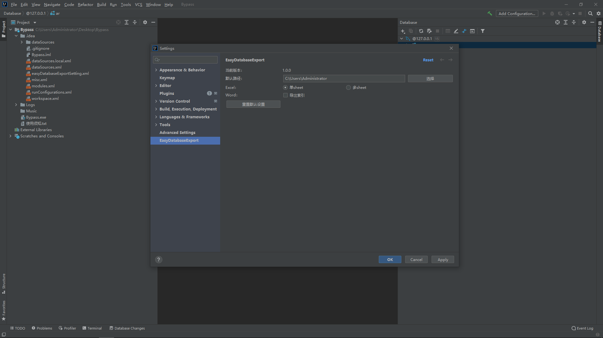

<div align="center">
   
   <a href="https://www.likethewind.top">
      <h1 align="center" style="color:#4da7fd">
         <b>EasyDataBaseExport</b>
      </h1>
   </a>
</div>

<p align="center">
    
    
    
    
    
</p> 

English | [简体中文](https://github.com/Zhuoyuan1/MySQLToWordOrExcel/blob/main/README_zh.MD)

## Table structure export
This tool is mainly used to export the table structure to facilitate the quick generation of the 《 Document of Database Structure》, and to quickly view the table structure and related information.  
The tool is free forever, welcome to experience!  
Download address: [here](https://www.likethewind.top/)  
Other versions: [download](https://wwr.lanzoui.com/b02c7c0cb) 【password:1111】

### 📖 Documentation   
[《Documentation of EasyDataBaseExport》](https://www.likethewind.top/)

### 💬  Runtime environment requirements

* 1.8.0_151+ （Recommended jdk_1.8.0_151, the unlimited strength governance policy is enabled for the JVM）

### 🔍 Database support

- &#10004; MySQL
- &#10004; Oracle
- &#10004; SqlServer
- &#10004; PostgreSQL
- &#10004; DM
- &#10004; KINGBASE8
- &#10004; DB2
- &#10004; XUGU 

### 📑 Document support

- &#10004; Word
- &#10004; Excel
- &#10004; Markdown 
- &#10004; Html 
- &#10004; Pdf 

### 👀 Function overview

> Tips：The resources mentioned in the figure are all from the network and are only used to show the tool functions. The copyright belongs to the author.  

+ Connect Page


+ Functions of Homepage


+ Export Custom

> `Word`、`Markdown`、`Html` and `Pdf` can export the `Primary-keys` and `Indexes` of table  
> `Excel` can export `Single sheet` or `More sheet`


The configuration location is as follows:    


+ Word


+ Excel


More sheet


+ Markdown


+ Html


+ Pdf


### ☕ Project structure

```md
EasyDataBaseExport
└─ src/main/java/com/easydatabaseexport
    ├── `common`   
    ├── `core`  
    ├── `database`  
    ├── `entities` 
    ├── `enums`  
    ├── `exception`
    ├── `factory`
    ├── `log`   
    ├── `navicat`
    ├── `ui` 
    └── `util`
```

### 🏃 How to run

* 1.Double-click jar
* 2.Command line input : java -jar *.jar
* 3.Run `EasyDataBaseExportMain` main-method

### 📦 Compile and package

  
Double click to run `assembly:assembly` to package

Note: Some adopted drivers are not uploaded to Maven warehouse  
If the packaging error is reported, you will be prompted that the package cannot be found. Please run `mvn install`  


### ⏳ Download

Lan zou yun：[https://wwr.lanzoui.com/b02c7c0cb](https://wwr.lanzoui.com/b02c7c0cb) password:1111  
Project：[https://gitee.com/lzy549876/EasyDataBaseExport](https://gitee.com/lzy549876/EasyDataBaseExport)

### 📧 Contact me

QQ: 963565242       
Mail: 963565242@qq.com

### 📌 Jetbrains plug-in

This plug-in is applicable to multiple JetBrains platforms (including but not limited to IntelliJ IDEA and PyCharm). It is developed based on the Database Tool, and all databases supported by the Database Tool are supported.  
It implements the core functions of this tool. Welcome to try!💖
  
Plug-in download address:      
[https://plugins.jetbrains.com/plugin/19672-easy-database-export](https://plugins.jetbrains.com/plugin/19672-easy-database-export)
> If this tool can help you, please click star, Thank you!!!